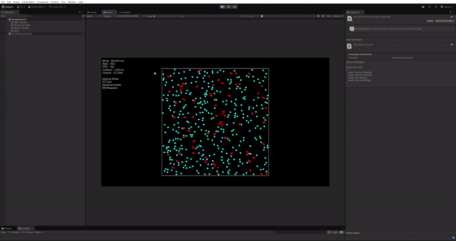

# Quadtree Collision Demo

> Quadtree 공간 분할로 **대량 객체의 충돌 검사를 최적화**한 Unity 테크 데모입니다.
> 공 4,000개 기준으로 Brute Force 대비 **비교 횟수 약 1,070배 감소**, **충돌 처리 시간 약 8.8배 단축**을 확인했습니다.

 

## 성능 비교
| Balls | Brute ms | Brute Checks | Quadtree ms | Quadtree Checks | 시간 단축 |
|---|---|---|---|---|---|
| 500 | 2.83 | 212,491 | 0.49 | 190 | 5.8배 |
| 1000 | 9.62 | 718,676 | 1.04 | 640 | 9.3배 |
| 2000 | 27.58 | 2,128,224 | 2.92 | 1,944 | 9.4배 |
| 4000 | 68.08 | 5,300,510 | 7.70 | 4,958 | 8.8배 |

- **ms**: 충돌 처리 구간만 측정한 프레임당 평균 시간입니다. Quadtree는 트리 구축 시간까지 포함합니다.
- **Checks**: 프레임당 원과 원의 거리 비교 횟수입니다.
- 측정 방법: 각 조건에서 워밍업 10프레임 이후 120프레임 평균(CPU)

### 분석
- **4,000개에서 Brute Force는 68ms**로 60FPS 기준 한 프레임(16.6ms)을 4배 넘지만, **Quadtree는 7.7ms**로 한 프레임 안에 들어옵니다.
- Brute Force는 **전체 객체 수**에 비례하고, Quadtree는 **실제 주변에 있는 후보**만 비교합니다. 그 결과 모든 구간에서 비교 횟수가 약 **1,000배** 적었습니다.
- 맵 크기를 고정한 채 객체 수를 늘렸기 때문에 밀도도 함께 증가합니다. 그래서 Quadtree의 비교 횟수 역시 객체 수보다 빠르게 늘어납니다. 

 
## 조작법
| 키 | 기능
|---|---|
| `Space` | Brute force <-> Quadtree 모드 전환 |
| `T` | Quadtree 노드 경계 표시 켜기/끄기 |
| `Up`/`Down` | 공 개수 증감(+-500) |
| `R` | 공 다시 배치 |
| `B` | 자동 벤치마크 실행(Console창에 출력) |

## 개선 방향
- **노드 풀링**: 측정 결과 Quadtree 비용의 대부분은 거리 비교가 아닌 트리 구축과 할당에서 발생합니다. 노드와 리스트를 재사용해서 매 프레임 할당과 GC 부담을 제거하는 것이 다음 단계입니다.
- **크기가 다른 객체 지원**: 현재는 중심점 기준으로 저장하므로, 크기가 다양해지면 쿼리 범위를 최대 반지름 기준으로 확장하거나 경계에 걸친 객체를 부모 노드에 보관하는 방식이 필요합니다.
- **중복 검사 제거**: A-B와 B-A를 각각 검사하고 있어, 쌍 단위로 한 번만 검사하도록 개선할 수 있습니다.

## 개발 환경
- Unity 6000.0.34f1 (URP)
- Input System 1.11